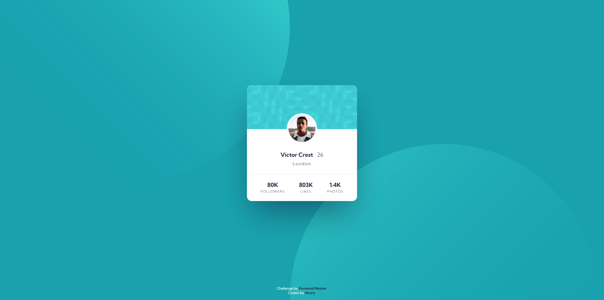

# Frontend Mentor - Profile card component solution

This is a solution to the [Profile card component challenge on Frontend Mentor](https://www.frontendmentor.io/challenges/profile-card-component-cfArpWshJ). 

## Table of contents

- [Overview](#overview)
  - [The challenge](#the-challenge)
  - [Screenshot](#screenshot)
  - [Links](#links)
- [My process](#my-process)
  - [Built with](#built-with)
  - [What I learned](#what-i-learned)
  - [Continued development](#continued-development)  
- [Author](#author)

## Overview

### The challenge

- Build out the project to the designs provided

### Screenshot



### Links

- Solution URL: [https://github.com/Henrydevlab/profile-card-component](https://github.com/Henrydevlab/profile-card-component)
- Live Site URL: [https://henrydevlab.github.io/profile-card-component/](https://henrydevlab.github.io/profile-card-component/)

## My process

### Built with

- Semantic HTML5 markup
- CSS custom properties
- Flexbox
- CSS Grid
- Mobile-first workflow

### What I learned

I leaned on absolute layout overlays mixed with responsive viewport positioning to center the complex background SVG circle patterns. Here is the background alignment implementation I used to get the circles sitting exactly where they belong across viewport shifts:

```css
body {
  background-color: var(--clr-primary-blue);
  background-image: url('./images/bg-pattern-top.svg'), url('./images/bg-pattern-bottom.svg');
  background-repeat: no-repeat, no-repeat;
  background-position: right 52vw bottom 40vh, left 48vw top 48vh;
}
```
### Continued development

- **Advanced Background Placement:** I want to keep refining how I handle shifting, complex vector decorative layers to make multi-image backgrounds completely effortless across varying display ratios.
- **Accessibility (a11y):** Ensuring correct screen reader interpretation via ARIA states on pure visual representations remains a key focus area moving forward.

## Author

- Frontend Mentor - [@henrydevlab](https://www.frontendmentor.io/profile/henrydevlab)
- Twitter - [@henrydevlab](https://www.twitter.com/henrydevlab)